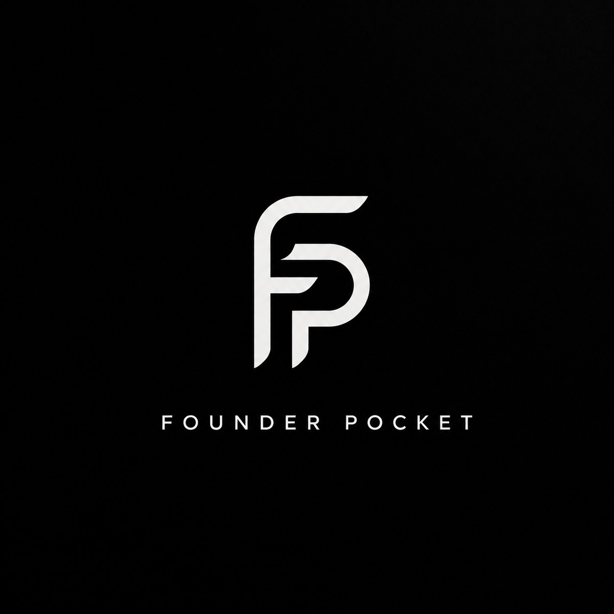

<p align="center">
  
</p>

<h1 align="center">Founder Pocket</h1>

<p align="center">
  <strong>The offline-first notebook built for founders.</strong><br/>
  Capture ideas, meetings, and decisions in under 60 seconds — nothing ever leaves your device.
</p>

<p align="center">
  
  
  
  
  
</p>

---

## What is it?

Founder Pocket is a private, offline Android notebook that understands founders' context. It's not a generic note app — every capture type, every AI feature, and every search query runs fully on-device using ONNX Runtime and MediaPipe's Gemma 3 1B.

**The one-minute constitution:** If any capture path takes longer than 60 seconds end-to-end, it gets cut.

---

## Features

### 12 Capture Types
| Type | What it captures |
|------|-----------------|
| **Note** | Quick free-text thought |
| **Voice** | Transcribed voice memo (offline STT, en-IN / hi-IN / Hinglish) |
| **Meeting** | Who, key points, action items, deadline — with live STT transcription |
| **Idea** | Problem → who has it → your solution |
| **Task** | Due date, done toggle |
| **Follow-up** | Contact + remind-at timestamp → local notification |
| **Contact** | Name, org, where you met, note |
| **Expense** | Amount + category (₹, on-device) |
| **Win** | One-sentence shipped milestone |
| **Link** | URL auto-categorised (repo / paper / post / video / web) |
| **Parking** | GPS coordinates + place label |
| **Doc** | File picker → AES-256-GCM encrypted on device |

### Search & Recall
- **Keyword search** via Room FTS4 — instant
- **Semantic search** via MiniLM embeddings (ONNX Runtime Mobile) — finds captures by meaning, not just keywords
- **Filters:** Near me · Today · This week

### Today Screen
- Open tasks and follow-ups surfaced automatically
- AI suggestion card (rules-based or Gemma 3 1B on-device)
- "Today I shipped…" one-line win logger

### Privacy & Security
- **Zero network** — no requests, no analytics, no telemetry
- **Document encryption** — AES-256-GCM-HKDF-4KB via Jetpack Security
- **Biometric app lock** — optional, 60-second idle timeout
- **Onboarding makes the privacy promise explicit**

---

## Architecture

```
app/
├── data/
│   ├── db/           Room + FTS4 (Capture entity, CaptureDao)
│   ├── model/        Capture, CaptureType enum, payload data classes
│   ├── ml/           EmbeddingManager (ONNX), LlmManager (MediaPipe Gemma)
│   ├── repository/   CaptureRepository
│   ├── security/     EncryptedDocStore (AES-256-GCM), AppLockManager
│   └── worker/       EmbedWorker (WorkManager), ReminderWorker
├── domain/
│   └── usecase/      SaveCaptureUseCase, SearchCapturesUseCase,
│                     GetSuggestionsUseCase
└── ui/
    ├── capture/      CaptureScreen + 12 typed forms
    ├── detail/       CaptureDetailScreen (read + share + edit + delete)
    ├── recall/       RecallScreen (keyword + semantic search)
    ├── today/        TodayScreen (focus list + AI suggestion + win log)
    ├── main/         MainScreen (3-tab BottomNavBar)
    ├── onboarding/   3-slide onboarding
    └── security/     BiometricGate composable
```

**Stack:**
- Kotlin 2.0.21, Jetpack Compose, Material 3
- Room FTS4 · WorkManager · Hilt · DataStore · Navigation Compose
- ONNX Runtime Mobile 1.22.0 (MiniLM-L6-v2 embeddings)
- MediaPipe tasks-genai 0.10.35 (Gemma 3 1B INT4)
- Jetpack Security (EncryptedFile, MasterKey)
- Kotlinx Serialization

---

## Getting Started

### Prerequisites
- Android Studio Hedgehog or later
- Android device / emulator running API 26+
- *(Optional)* Gemma 3 1B model file for on-device AI suggestions

### Build

```bash
git clone https://github.com/VatsalyaBhadaurya/Founder-Pocket.git
cd Founder-Pocket
./gradlew assembleDebug
```

Install on device:
```bash
adb install app/build/outputs/apk/debug/app-debug.apk
```

### On-device AI (optional)

Semantic search works out of the box with the bundled MiniLM ONNX model. For the Gemma 3 1B AI suggestions, place the model file at:
```
app/src/main/assets/gemma3-1b-it-int4.task
```

If the model is absent, the app falls back to a rules-based suggestion engine automatically.

---

## Privacy Policy

> **Nothing ever leaves your device.**

All captures, embeddings, and documents are stored locally. There is no backend, no sync, no analytics SDK, and no network permission declared in the manifest.

Full policy: [`app/src/main/assets/privacy_policy.html`](app/src/main/assets/privacy_policy.html)

---

## Roadmap

- [ ] Share-to-capture from any app (ACTION_SEND intent)
- [ ] Voice capture with background noise suppression
- [ ] Export to Markdown / JSON (local only)
- [ ] Home screen widget for one-tap capture
- [ ] Gemma 3 meeting summarisation

---

## License

MIT © 2026 [Nextgen Research Lab And Infrastructure Development Pvt. Ltd.](https://nextgenrl.com)
